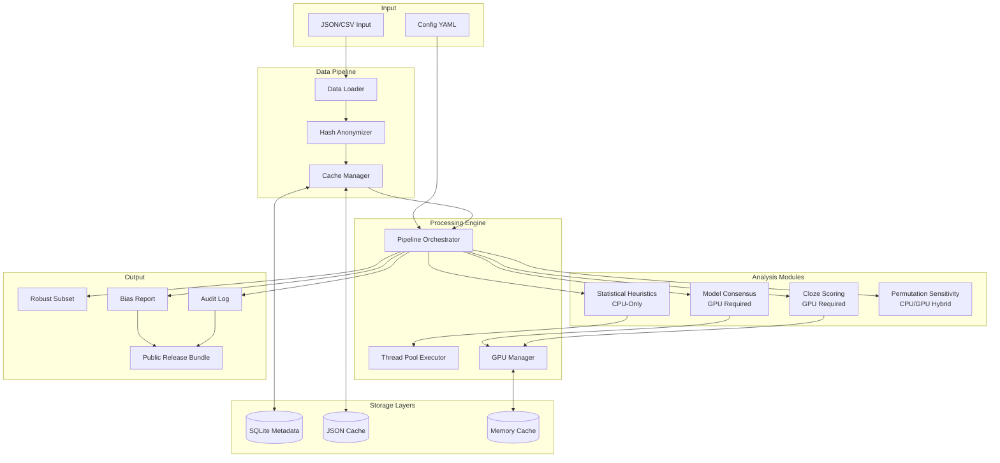
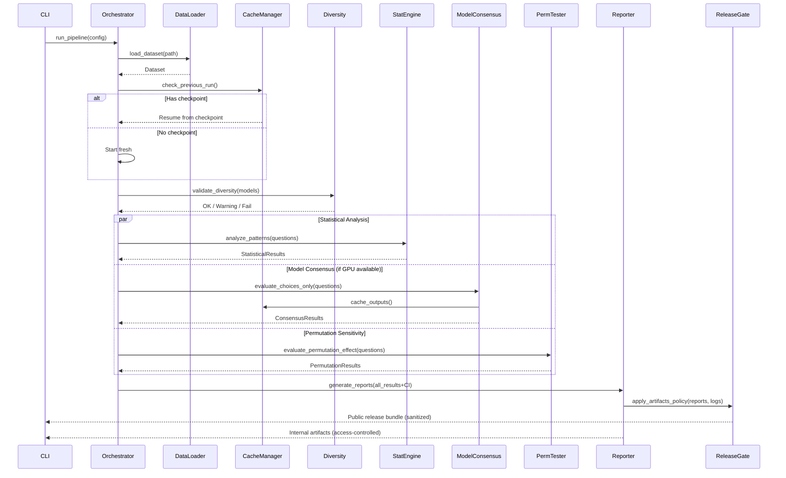

# RobustCBRN Eval Technical Architecture Document

## Introduction

This document outlines the complete technical architecture for RobustCBRN Eval, a robust evaluation pipeline for CBRN-related AI safety benchmarks. It serves as the authoritative guide for implementing a system that identifies and removes 25-35% of exploitable MCQA questions using proven robustification techniques while maintaining radical dependency minimization and fail-graceful operation.

The architecture prioritizes transparency, auditability, and resilience, ensuring that every algorithm can be understood by judges in minutes while gracefully degrading when resources are constrained.

### Change Log

| Date | Version | Description | Author |
|------|---------|-------------|--------|
| 2025-01-12 | v1.0 | Initial architecture creation based on PRD v1.0 | Winston |

## High Level Architecture

### Technical Summary

RobustCBRN Eval implements a modular pipeline architecture with pluggable components for consensus detection, statistical analysis, and cloze scoring that can fail independently. The system employs multi-level caching (SQLite metadata, JSON model outputs, memory logits) with checkpoint recovery, sequential model loading to manage 2–3 7B parameter models on a single A100 GPU, and pure NumPy implementations of all statistical methods. The architecture ensures that statistical analysis continues functioning even if GPU inference fails. All processing supports a deterministic mode with fixed seeds and stable execution order to meet <2% run-to-run variance. A model diversity policy enforces heterogeneous open‑source families per PRD (e.g., Llama/Meta, Mistral, Qwen, OLMo). A two‑tier artifacts policy governs sensitive data: caches never store plaintext; internal logs may include rendered prompts for reproducibility under access controls; public artifacts contain only sanitized aggregates. Confidence‑interval–backed filtering, permutation sensitivity testing, and cost/throughput instrumentation align outcomes with the PRD’s quantitative goals.

### Platform and Infrastructure Choice

**Platform:** Linux (Ubuntu 20.04+) with CUDA 11.8+
**Deployment Target:** Lambda GPU Cloud / Local GPU workstation
**GPU Requirements:** 24GB+ VRAM (optimal: A100 40GB)
**Storage:** Local NVMe SSD for high-speed caching (100–150GB for MVP; 500GB recommended for scaling)
**Container Support:** Docker for reproducible environment

### Repository Structure

**Structure:** Monorepo with clear module separation
**Package Management:** Python native with virtual environments
**Module Organization:** 
- Core pipeline modules (`src/`)
- Statistical analysis (`src/analysis/`)
- Model inference (`src/models/`)
- Utilities (`src/utils/`)
- Configuration (`configs/`)
- Tests (`tests/`)

### High Level Architecture Diagram



### Architectural Patterns

- **Modular Pipeline Pattern:** Independent components that can be enabled/disabled/combined via configuration - _Rationale:_ Enables graceful degradation when GPU unavailable and parallel development
- **Multi-Level Caching:** SQLite for metadata, JSON for model outputs, memory for active logits - _Rationale:_ Optimizes for different access patterns and recovery scenarios
- **Fail-Graceful Degradation:** Continue with available components if others fail - _Rationale:_ Critical for hackathon demo resilience and production reliability
- **Checkpoint Recovery:** Save state every 100 questions with automatic resume - _Rationale:_ Handles interruptions common in GPU cloud environments
- **Pure Function Statistical:** All statistics implemented as pure functions without side effects - _Rationale:_ Ensures reproducibility and testability
- **Sequential Model Loading:** Load/unload models one at a time to manage memory - _Rationale:_ Enables running 2-3 7B models on single GPU
- **Deterministic Execution Mode:** Fixed seeds, sorted operations, controlled initialization, deterministic kernels, and disabled non-deterministic GPU optimizations when required - _Rationale:_ Meets <2% variance target across runs
- **Hash-Based Anonymization:** SHA-256 with two salts for question IDs (private per-project salt for internal artifacts; fixed public salt for sanitized subset) - _Rationale:_ Enables tracking and public reproducibility without exposing content; caches never store plaintext
- **Model Family Diversity Policy:** Enforce heterogeneous open-source model families (e.g., Llama/Meta, Mistral, Qwen, OLMo) with warnings/fail-fast if violated - _Rationale:_ Satisfies FR1 and strengthens consensus signal while maintaining open reproducibility
- **CI-Backed Filtering:** Integrate bootstrap confidence intervals into filter decisions and reports - _Rationale:_ Satisfies FR7/FR9 with quantified uncertainty
- **Permutation Sensitivity:** Random 0–1 option reorder per item with re-scoring and delta analysis - _Rationale:_ Satisfies FR11 and reveals brittle question formats

## Tech Stack

### Core Dependencies (Minimal by Design)

| Category | Technology | Version | Purpose | Rationale |
|----------|------------|---------|---------|-----------|
| Language | Python | 3.10+ | Primary implementation | ML ecosystem standard |
| ML Framework | PyTorch | 2.0+ | Model inference | Industry standard, best GPU support |
| Model Library | Transformers | 4.36+ | Model loading/inference | Handles diverse architectures |
| Numerical | NumPy | 1.24+ | Statistical computations | Sufficient for all statistics |
| Progress | tqdm | 4.66+ | Progress bars | Lightweight, informative |
| Data Storage | SQLite3 | Built-in | Metadata caching | No external dependency |
| Data Parsing | json/csv | Built-in | Input/output handling | Sufficient for needs |
| CLI | argparse | Built-in | Command-line interface | Simple, sufficient |
| Config | dataclasses | Built-in | Configuration management | Type-safe, no deps |
| Testing | unittest | Built-in | Test framework | Adequate for needs |
| Logging | logging | Built-in | Structured logging | Standard library |
| Parallelism | concurrent.futures | Built-in | CPU parallelization | Simple, effective |
| Hashing | hashlib | Built-in | Question anonymization | Cryptographically secure |

### Optional Extras (Gated and Fallbacks Defined)

| Category | Technology | Purpose | Notes |
|----------|------------|---------|-------|
| Quantization | bitsandbytes | 8-bit loading | Optional; fallback to fp16 if unavailable |
| Attention | flash-attn | Throughput | Optional; disabled in deterministic mode |
| Logging | python-json-logger | JSON logs | Optional; stdlib logging used by default |
| Statistics | SciPy | BCa bootstrap only | Optional; default method is percentile without SciPy |

## Component Architecture

### Core Pipeline Components

#### 1. Data Loader Module
**Responsibility:** Load and normalize input data from various formats

**Key Interfaces:**
- `load_dataset(path: str, format: str) -> Dataset`
- `validate_schema(data: Dict) -> bool`
- `normalize_format(data: Any) -> Dataset`

**Dependencies:** None (uses built-in json/csv)

**Implementation:**
```python
@dataclass
class Question:
    id: str  # SHA-256 hash
    choices: List[str]
    answer_index: int
    metadata: Dict[str, Any]
```

#### 1a. Model Diversity Policy & Checker
**Responsibility:** Enforce heterogeneous model families per PRD

**Policy:**
- Require 2–3 models from distinct open-source families (e.g., Llama/Meta, OLMo/AllenAI, Mistral, Qwen, Phi). Closed APIs are out-of-scope for MVP to preserve determinism, logging, and safety posture. Select local models that maximize architectural diversity and document the selection in the audit log.
- At run start, compute family signatures from model identifiers/configs and fail-fast or warn if insufficient diversity.

**Key Interfaces:**
- `detect_model_family(model_name_or_path: str) -> Literal['meta','allenai','mistral','qwen','phi','other']`
- `validate_diversity(families: List[str], required: int = 2) -> None`

#### 2. Cache Manager
**Responsibility:** Multi-level caching with checkpoint recovery

**Key Interfaces:**
- `cache_model_output(question_id: str, model_id: str, output: Any)`
- `get_cached_output(question_id: str, model_id: str) -> Optional[Any]`
- `save_checkpoint(state: PipelineState)`
- `recover_from_checkpoint() -> Optional[PipelineState]`

**Dependencies:** SQLite3 for metadata, JSON for outputs

**Implementation:**
- SQLite: Question metadata, processing status
- JSON files: Model outputs (one file per 100 questions)
- Memory: Active batch logits (cleared between models)
 - Content policy: No plaintext question or prompt content in cache; keys are hashed IDs

#### 3. Statistical Analysis Engine
**Responsibility:** Pure NumPy implementations of all statistical tests

**Key Interfaces:**
- `calculate_bootstrap_ci(data: np.ndarray, statistic: Callable, n_iterations: int = 10000) -> Tuple[float, float]`
- `chi_square_test(observed: np.ndarray, expected: np.ndarray) -> ChiSquareResult`
- `detect_position_bias(questions: List[Question]) -> BiasReport`
- `analyze_lexical_patterns(questions: List[Question]) -> PatternReport`

**Dependencies:** NumPy only

**Mathematical Documentation:**
```python
def bootstrap_ci(data, statistic, n_iterations=10000, confidence=0.95):
    """
    Bootstrap Confidence Interval (Percentile Method)
    
    Mathematical formulation:
    Given data X = {x₁, x₂, ..., xₙ} and statistic θ
    1. Generate B bootstrap samples X*ᵢ by sampling with replacement
    2. Calculate θ*ᵢ = statistic(X*ᵢ) for i = 1...B
    3. CI = [θ*_(α/2), θ*_(1-α/2)] where α = 1 - confidence
    
    Implementation uses vectorized NumPy operations for efficiency.
    """
    n = len(data)
    bootstrap_stats = np.empty(n_iterations)
    
    for i in range(n_iterations):
        sample = data[np.random.choice(n, n, replace=True)]
        bootstrap_stats[i] = statistic(sample)
    
    lower = np.percentile(bootstrap_stats, (1 - confidence) / 2 * 100)
    upper = np.percentile(bootstrap_stats, (1 + confidence) / 2 * 100)
    
    return lower, upper
```

**Performance Notes:**
- Bootstrap iterations configurable; default 10k, may auto-reduce for large datasets to meet runtime budgets (e.g., 2k–5k) while reporting the actual iterations used in the report.
- Vectorize where feasible and reuse RNG states; parallelize independent tests via the thread pool.

#### 4. Model Consensus Detector
**Responsibility:** Implement Deep Ignorance §D.4 choices-only evaluation

**Key Interfaces:**
- `evaluate_choices_only(model: AutoModelForCausalLM, choices: List[str]) -> int`
- `calculate_consensus(predictions: List[int]) -> ConsensusResult`
- `identify_exploitable(consensus_results: List[ConsensusResult]) -> List[str]`
 - `store_rendered_prompt(question_id: str, model_id: str, prompt: str, internal: bool) -> None`

**Dependencies:** PyTorch, Transformers

**Memory Management:**
```python
class SequentialModelLoader:
    def load_model(self, model_name: str):
        # Clear any existing model
        if self.current_model:
            del self.current_model
            torch.cuda.empty_cache()
        
        # Load with appropriate precision
        self.current_model = AutoModelForCausalLM.from_pretrained(
            model_name,
            torch_dtype=torch.float16,
            device_map="auto",
            load_in_8bit=self.quantize
        )
```

**Choices-Only Scoring (Methodology):**
- Construct prompts that present answer options without the stem; template per architecture with minimal special tokens.
- Score each option with a single forward pass per option using token log-probabilities over the option string (no generation), then select argmax of length-normalized logprob: `score = sum(logp(tokens)) / len(tokens)`.
- Batch options across questions to maximize GPU utilization; cache per-question per-model scores (not raw text).
 - Store exact rendered prompts internally (access-controlled) for reproducibility; publish only templates and rendering logic in the Prompts Appendix.

```python
@torch.inference_mode()
def score_option_texts(model, tokenizer, prefix: str, options: List[str]) -> List[float]:
    """Return length-normalized logprob for each option given a prefix.
    Stores no plaintext in cache; call-site maps back to hashed IDs.
    """
    device = model.device
    scores = []
    for opt in options:
        text = prefix + opt
        enc = tokenizer(text, return_tensors='pt').to(device)
        # labels equal to input_ids to compute token-wise NLL
        labels = enc.input_ids.clone()
        # Mask prefix tokens so only option tokens contribute
        prefix_len = len(tokenizer(prefix)['input_ids'])
        labels[:, :prefix_len] = -100
        out = model(**enc, labels=labels)
        # Negative loss is mean logprob over unmasked tokens; recover sum/len
        # out.loss = -mean(logprob)
        unmasked = (labels != -100).sum().item()
        avg_logprob = -out.loss.item()
        scores.append(avg_logprob)  # already mean over option tokens
    return scores
```

#### 4b. Cloze Scoring Module (Verified)
**Responsibility:** Convert MCQA to cloze form and compute length-normalized logprob per option

**Key Interfaces:**
- `to_cloze(question: Question, template: str) -> List[str]  # per-option text`
- `score_options(model, tokenizer, option_texts: List[str]) -> List[float]  # length-normalized`

**Methodology:**
- Use deterministic templates per domain; compute log-prob of the option completion given the cloze context via one forward pass per option; normalize by token count to mitigate length bias.
- Limit to configured subset size (e.g., 500 items) to meet compute budget.

#### 5. Pipeline Orchestrator
**Responsibility:** Coordinate component execution with fail-graceful behavior

**Key Interfaces:**
- `run_pipeline(config: PipelineConfig) -> PipelineResult`
- `handle_component_failure(component: str, error: Exception) -> bool`
- `generate_reports(results: PipelineResult) -> None`

**Dependencies:** All other components

**Fail-Graceful Logic:**
```python
def run_analysis(self, questions: List[Question]) -> AnalysisResult:
    results = AnalysisResult()

    # Validate model family diversity before GPU work
    try:
        families = [detect_model_family(m) for m in self.config.models]
        validate_diversity(families, required=2)
    except Exception as e:
        self.logger.warning(f"Diversity validation: {e}")
    
    # Always run statistical analysis (CPU-only, reliable)
    try:
        results.statistical = self.stat_engine.analyze(questions)
    except Exception as e:
        self.logger.error(f"Statistical analysis failed: {e}")
        results.statistical = None
    
    # Try GPU-based analyses if available
    if torch.cuda.is_available():
        try:
            results.consensus = self.consensus_detector.analyze(questions)
        except Exception as e:
            self.logger.warning(f"Consensus detection failed: {e}, continuing...")
            results.consensus = None
    
    # Continue with whatever succeeded
    return results
```

#### 6. Permutation Sensitivity Tester
**Responsibility:** Measure answer stability to random option order changes

**Key Interfaces:**
- `permute_once(choices: List[str], seed: int) -> Tuple[List[str], PermutationMap]`
- `evaluate_permutation_effect(question: Question, models: List[str]) -> PermutationResult`

**Methodology:**
- For each question, perform 0–1 random permutation of options (controlled by seed), re-run choices-only (or cloze) scoring, and compute delta in predictions/scores.
- Aggregate permutation sensitivity metrics with bootstrap CIs and include in bias report.

#### 7. CI‑Backed Filtering & Reporting
**Responsibility:** Produce robust subsets using consensus + statistical tests with quantified uncertainty

**Decision Logic:**
- Flag exploitable items via configurable consensus strategies (unanimous/majority/weighted) on choices-only results, plus corroborating heuristics (e.g., longest-answer) and permutation sensitivity.
- Compute removal rate and key statistics with bootstrap 95% CIs (percentile method). Include per-question decision rationale (e.g., `consensus=3/3`, `longest_answer=match`, `perm_delta>τ`).

**Outputs:**
- Internal (access-controlled):
  - `robust_subset.jsonl` with private-salt hashed IDs and keep/remove decisions; no raw text
  - `bias_report.internal.json` including CIs, p-values, effect sizes, permutation metrics, and run metadata
  - `audit_log.jsonl` with IDs, timestamps, seeds, model families, decision rationale
- Public (sanitized via ReleaseGate):
  - `bias_report.public.json` with aggregate metrics and CIs; no per-item details beyond the sanitized calibration subset
  - `calibration_subset_ids.txt` (public-salt IDs only)
  - `prompts_appendix.md` (templates and rendering logic; no hazardous content)
  - `reproducibility_bundle.json` (commands, seeds, versions, model SHAs, checksums)

## Data Flow Architecture

### Processing Pipeline Stages



## Determinism Controls

To achieve low run-to-run variance and reproducibility:
- Set seeds: `random.seed(SEED)`, `np.random.seed(SEED)`, `torch.manual_seed(SEED)`, `torch.cuda.manual_seed_all(SEED)`
- PyTorch: `torch.use_deterministic_algorithms(True)` (PyTorch 2.x)
- cuDNN: `CUDNN_DETERMINISTIC=1`, `CUDNN_BENCHMARK=0`
- cuBLAS: `CUBLAS_WORKSPACE_CONFIG=:4096:8` (or `:16:8`)
- Python hashing: `PYTHONHASHSEED=0`
- Tokenizers: `TOKENIZERS_PARALLELISM=false`
- Disable CPU/GPU nondeterministic ops; sort data structures; enforce stable iteration order

Document all settings in the Reproducibility Bundle.

## Caching Strategy

### Multi-Level Cache Architecture

```python
class CacheHierarchy:
    """
    Three-level caching system optimized for different access patterns and safety:
    
    L1 (Memory): Active batch logits - Cleared between models
    L2 (SQLite): Question metadata, status - Persistent, fast queries
    L3 (JSON): Model outputs - Persistent, space-efficient, NO PLAINTEXT CONTENT (IDs only, numeric scores)
    
    Two-tier policy: caches never contain plaintext; internal plaintext may exist in access-controlled logs only.
    """
    
    def __init__(self, cache_dir: Path):
        self.cache_dir = cache_dir
        self.memory_cache = {}  # L1: Active logits
        self.db_path = cache_dir / "metadata.db"  # L2: SQLite
        self.output_dir = cache_dir / "outputs"  # L3: JSON files
        
        self._init_db()
        self.output_dir.mkdir(exist_ok=True)

        # Content policy (two-tier): cache only non-sensitive artifacts
        # - keys: hashed question IDs (private salt internally, public salt for sanitized subset)
        # - values: indices, numeric scores/logits, configuration hashes
        # - never: question text, choices text, prompts, completions
    
    def get(self, key: str, level: int = 3) -> Optional[Any]:
        # Try L1 (memory)
        if level >= 1 and key in self.memory_cache:
            return self.memory_cache[key]
        
        # Try L2 (SQLite) for metadata
        if level >= 2:
            result = self._query_db(key)
            if result:
                return result
        
        # Try L3 (JSON) for full outputs
        if level >= 3:
            json_path = self.output_dir / f"{key[:8]}.json"
            if json_path.exists():
                with open(json_path) as f:
                    data = json.load(f)
                    return data.get(key)
        
        return None

    def redact_for_release(self, report_paths: List[Path]) -> Path:
        """
        Apply artifacts policy to produce a sanitized public bundle.
        - Remove any residual plaintext fields
        - Replace private-salt IDs with public-salt IDs for sanitized subset
        - Include checksums and metadata
        Returns path to the tarball/zip of public artifacts.
        """
        # Implementation detail deferred; ensure checks are part of release gate
        ...
```

### Checkpoint Recovery System

```python
@dataclass
class PipelineState:
    """Checkpoint state for recovery"""
    timestamp: datetime
    questions_processed: int
    questions_total: int
    components_completed: List[str]
    results_so_far: Dict[str, Any]
    config_hash: str  # Detect config changes
    
    def save(self, path: Path):
        """Save checkpoint atomically"""
        temp_path = path.with_suffix('.tmp')
        with open(temp_path, 'w') as f:
            json.dump(asdict(self), f, default=str)
        temp_path.replace(path)  # Atomic on POSIX
    
    @classmethod
    def load(cls, path: Path) -> Optional['PipelineState']:
        """Load checkpoint with validation"""
        if not path.exists():
            return None
        
        try:
            with open(path) as f:
                data = json.load(f)
            return cls(**data)
        except Exception as e:
            logger.warning(f"Invalid checkpoint: {e}")
            return None
```

## Memory Management Strategy

### Sequential Model Loading

```python
class MemoryEfficientModelManager:
    """
    Manages sequential loading of multiple 7B models on single GPU.
    Key strategies:
    - Load one model at a time
    - Use 8-bit quantization when needed
    - Clear cache between models
    - Monitor memory usage
    """
    
    def __init__(self, max_memory_gb: int = 40, deterministic: bool = True, quantize: bool = False):
        self.max_memory_gb = max_memory_gb
        self.current_model = None
        self.current_tokenizer = None
        self.deterministic = deterministic
        self.quantize = quantize
    
    def process_with_models(
        self, 
        model_names: List[str], 
        questions: List[Question]
    ) -> Dict[str, List[int]]:
        results = {}
        
        for model_name in model_names:
            # Check available memory
            available_gb = self._get_available_memory()
            
            # Determine loading strategy
            if available_gb < 15:
                logger.info(f"Low memory, using 8-bit for {model_name}")
                quantize = True
            else:
                quantize = False
            
            # Load model
            self._load_model(model_name, quantize=quantize)
            
            # Process in batches
            batch_size = self._adaptive_batch_size()
            predictions = []
            
            for i in range(0, len(questions), batch_size):
                batch = questions[i:i+batch_size]
                batch_preds = self._process_batch(batch)
                predictions.extend(batch_preds)
                
                # Save intermediate results
                if i % 100 == 0:
                    self._save_checkpoint(model_name, predictions)
            
            results[model_name] = predictions
            
            # Cleanup for next model
            self._cleanup()
        
        return results
    
    def _adaptive_batch_size(self) -> int:
        """Dynamically adjust batch size based on available memory"""
        available_gb = self._get_available_memory()
        
        if available_gb > 20:
            return 32
        elif available_gb > 10:
            return 16
        elif available_gb > 5:
            return 8
        else:
            return 4
    
    def _cleanup(self):
        """Free memory between models"""
        del self.current_model
        del self.current_tokenizer
        self.current_model = None
        self.current_tokenizer = None
        
        torch.cuda.empty_cache()
        gc.collect()
```

## Determinism & Reproducibility

### Deterministic Mode Settings

```python
def enable_determinism(seed: int):
    import random, os
    random.seed(seed)
    np.random.seed(seed)
    torch.manual_seed(seed)
    torch.cuda.manual_seed_all(seed)

    # Torch deterministic algorithms
    torch.use_deterministic_algorithms(True)

    # cuDNN / CUDA determinism
    torch.backends.cudnn.deterministic = True
    torch.backends.cudnn.benchmark = False

    # Disable TF32 for determinism
    torch.backends.cuda.matmul.allow_tf32 = False
    torch.backends.cudnn.allow_tf32 = False

    # Encourage deterministic cublas (set before torch init in CLI)
    os.environ.setdefault('CUBLAS_WORKSPACE_CONFIG', ':4096:8')

    # Disable non-deterministic optimizations if enabled elsewhere
    # (BetterTransformer/Flash-Attn are disabled when deterministic mode is on)
```

All stochastic components (bootstrap CI, permutations) draw RNG from a seeded generator derived from the top-level seed and component-specific offsets to ensure reproducible results across runs.

## Security Design

### Hash-Based Anonymization System

```python
class SecurityManager:
    """
    Implements hash-based anonymization with configurable redaction.
    Two-tier salts:
    - private_salt: per-project (internal artifacts)
    - public_salt: fixed (for sanitized calibration subset IDs only)
    No plaintext question content in public artifacts.
    """
    
    def __init__(self, private_salt: str = None, public_salt: str = None):
        if private_salt is None:
            private_salt = secrets.token_hex(32)
        if public_salt is None:
            public_salt = "public-sanitized-salt-v1"
        
        self.private_salt = private_salt.encode()
        self.public_salt = public_salt.encode()
        self.redaction_level = "moderate"  # low, moderate, high
    
    def _content_signature(self, question: Dict) -> bytes:
        """Canonical content signature used for hashing (not stored)."""
        return json.dumps(
            {"q": question.get("question", ""),
             "c": question.get("choices", [])},
            sort_keys=True
        ).encode()

    def internal_id(self, question: Dict) -> str:
        """Generate SHA-256 ID with private salt for internal artifacts."""
        content = self._content_signature(question)
        digest = hashlib.sha256(self.private_salt + content).hexdigest()
        return digest[:32]

    def public_id_for_calibration(self, question: Dict) -> str:
        """Generate SHA-256 ID with public salt (sanitized subset only)."""
        content = self._content_signature(question)
        digest = hashlib.sha256(self.public_salt + content).hexdigest()
        return digest[:32]

    def anonymize_question(self, question: Dict) -> Dict:
        return {
            "id": self.internal_id(question),
            "choice_count": len(question.get("choices", [])),
            "answer_position": question.get("answer", -1),
            # No question text stored
        }
    
    def redact_output(self, content: str) -> str:
        """Apply redaction based on security level"""
        if self.redaction_level == "high":
            # Remove all specific values
            content = re.sub(r'\b\d+\.\d+\b', '[REDACTED]', content)
            content = re.sub(r'"(question|choices|prompt)":\s*".*?"', '"\\1":"[REDACTED]"', content)
        elif self.redaction_level == "moderate":
            # Keep aggregate statistics only (IDs, indices, scores)
            content = re.sub(r'"(question|choices|prompt)":\s*".*?"', '"\\1":"[REDACTED]"', content)
        
        return content
```

## Parallel Execution Strategy

### Thread Pool for Statistical Analysis

```python
class ParallelStatisticalEngine:
    """
    Parallelizes independent statistical tests using thread pool.
    CPU-bound operations distributed across cores.
    """
    
    def __init__(self, max_workers: int = None):
        if max_workers is None:
            max_workers = min(8, (os.cpu_count() or 1))
        
        self.executor = ThreadPoolExecutor(max_workers=max_workers)
    
    def analyze_all(self, questions: List[Question]) -> StatisticalReport:
        """Run all statistical tests in parallel"""
        
        # Define independent test functions
        tests = {
            'position_bias': self._test_position_bias,
            'length_bias': self._test_length_bias,
            'lexical_patterns': self._test_lexical_patterns,
            'answer_distribution': self._test_answer_distribution,
        }
        
        # Submit all tests
        futures = {
            name: self.executor.submit(test_func, questions)
            for name, test_func in tests.items()
        }
        
        # Collect results
        results = {}
        for name, future in futures.items():
            try:
                results[name] = future.result(timeout=30)
            except Exception as e:
                logger.error(f"Test {name} failed: {e}")
                results[name] = None
        
        return StatisticalReport(**results)
    
    def _test_position_bias(self, questions: List[Question]) -> BiasResult:
        """Chi-square test for answer position distribution"""
        positions = [q.answer_position for q in questions]
        observed = np.bincount(positions, minlength=4)
        expected = np.full(4, len(questions) / 4)
        
        # Chi-square statistic
        chi2 = np.sum((observed - expected) ** 2 / expected)
        
        # Bootstrap CI for effect size
        def effect_size(data):
            counts = np.bincount(data, minlength=4)
            return np.std(counts) / np.mean(counts)
        
        ci_lower, ci_upper = bootstrap_ci(
            np.array(positions),
            effect_size,
            n_iterations=10000
        )
        
        return BiasResult(
            statistic=chi2,
            p_value=self._chi2_p_value(chi2, df=3),
            effect_size_ci=(ci_lower, ci_upper),
            flagged=chi2 > 7.815  # Critical value at p=0.05
        )
```

### GPU Optimization for Model Inference

```python
class OptimizedGPUInference:
    """
    GPU optimization strategies for model inference.
    """
    
    def __init__(self, deterministic: bool = False):
        self.deterministic = deterministic
        self.use_flash_attention = (not deterministic) and self._check_flash_attention()
        self.compile_model = (not deterministic) and (torch.__version__ >= "2.0")
    
    def optimize_model(self, model: AutoModelForCausalLM) -> AutoModelForCausalLM:
        """Apply optimizations to model"""
        
        # Flash Attention 2 if available (disabled in deterministic mode)
        if self.use_flash_attention:
            model = model.to_bettertransformers()
        
        # Torch compile for inference optimization (disabled in deterministic mode)
        if self.compile_model:
            model = torch.compile(
                model,
                mode="reduce-overhead",
                fullgraph=True
            )
        
        # Mixed precision
        model = model.half()  # FP16 (use bf16 where supported)
        
        return model
    
    @torch.inference_mode()
    def batch_inference(
        self,
        model: AutoModelForCausalLM,
        tokenizer: AutoTokenizer,
        prompts: List[str],
        batch_size: int = 16
    ) -> List[int]:
        """Efficient batched inference"""
        
        predictions = []
        
        for i in range(0, len(prompts), batch_size):
            batch = prompts[i:i+batch_size]
            
            # Tokenize with padding
            inputs = tokenizer(
                batch,
                return_tensors="pt",
                padding=True,
                truncation=True,
                max_length=512
            ).to(model.device)
            
            # Score efficiently (prefer scoring over generation for choices/cloze)
            with torch.cuda.amp.autocast():
                outputs = model.generate(
                    **inputs,
                    max_new_tokens=1,
                    do_sample=False,
                    pad_token_id=tokenizer.pad_token_id
                )
            
            # Decode predictions
            batch_preds = self._decode_predictions(outputs, tokenizer)
            predictions.extend(batch_preds)
        
        return predictions
```

## Fail-Graceful Architecture Patterns

### Component Isolation and Fallback

```python
class FailGracefulPipeline:
    """
    Implements fail-graceful patterns ensuring pipeline continues
    even when components fail.
    """
    
    def __init__(self, config: PipelineConfig):
        self.config = config
        self.components = self._initialize_components()
        self.failures = []
    
    def run(self, questions: List[Question]) -> PipelineResult:
        """Run pipeline with graceful degradation"""
        
        result = PipelineResult()
        
        # Level 1: Always-available statistical analysis
        result.statistical = self._run_safe(
            self.components['statistical'],
            questions,
            fallback=BasicStatistics()
        )
        
        # Level 2: GPU-dependent consensus (optional)
        if self._check_gpu_available():
            result.consensus = self._run_safe(
                self.components['consensus'],
                questions,
                fallback=None  # No fallback, just skip
            )
        else:
            logger.warning("GPU unavailable, skipping consensus detection")
            self.failures.append("consensus: no GPU")
        
        # Level 3: Memory-intensive cloze (optional)
        if result.consensus and self._check_memory_available(threshold_gb=30):
            result.cloze = self._run_safe(
                self.components['cloze'],
                questions,
                fallback=None
            )
        
        # Generate report with available results
        result.report = self._generate_adaptive_report(result)
        
        return result
    
    def _run_safe(self, component: Any, input_data: Any, fallback: Any = None):
        """Execute component with error handling"""
        try:
            return component.process(input_data)
        except Exception as e:
            logger.error(f"Component {component.__class__.__name__} failed: {e}")
            self.failures.append(f"{component.__class__.__name__}: {str(e)}")
            
            if fallback:
                logger.info(f"Using fallback for {component.__class__.__name__}")
                return fallback.process(input_data)
            
            return None
    
    def _generate_adaptive_report(self, result: PipelineResult) -> Report:
        """Generate report adapting to available results"""
        
        report = Report()
        report.metadata['failures'] = self.failures
        
        # Always include statistical results
        if result.statistical:
            report.add_section("Statistical Analysis", result.statistical)
        
        # Include GPU results if available
        if result.consensus:
            report.add_section("Model Consensus", result.consensus)
        else:
            report.add_note("Model consensus skipped (GPU unavailable)")
        
        if result.cloze:
            report.add_section("Cloze Format Comparison", result.cloze)
        
        # Adjust confidence based on available components
        confidence = 0.95 if result.consensus else 0.80
        report.metadata['confidence'] = confidence
        
        return report
```

## Project Structure

```
robustcbrn-eval/
├── src/
│   ├── __init__.py
│   ├── pipeline.py                 # Main orchestrator
│   ├── config.py                   # Configuration dataclasses
│   │
│   ├── data/
│   │   ├── __init__.py
│   │   ├── loader.py              # Dataset loading
│   │   ├── schemas.py             # Data models
│   │   └── validators.py          # Input validation
│   │
│   ├── analysis/
│   │   ├── __init__.py
│   │   ├── statistical.py         # Pure NumPy statistics
│   │   ├── bootstrap.py           # Bootstrap CI implementation
│   │   ├── chi_square.py          # Chi-square tests
│   │   ├── patterns.py            # Lexical pattern detection
│   │   ├── permutation.py         # Permutation sensitivity testing
│   │   └── bias_metrics.py        # Bias calculations
│   │
│   ├── models/
│   │   ├── __init__.py
│   │   ├── consensus.py           # Consensus detection
│   │   ├── cloze.py              # Cloze scoring
│   │   ├── loader.py             # Model loading/management
│   │   └── inference.py          # Optimized inference
│   │
│   ├── cache/
│   │   ├── __init__.py
│   │   ├── manager.py            # Cache orchestration
│   │   ├── sqlite_cache.py       # SQLite layer
│   │   ├── json_cache.py         # JSON layer
│   │   └── checkpoint.py         # Checkpoint system
│   │
│   ├── security/
│   │   ├── __init__.py
│   │   ├── anonymizer.py         # Hash-based anonymization
│   │   └── redactor.py           # Output redaction
│   │
│   ├── reporting/
│   │   ├── __init__.py
│   │   ├── generator.py          # Report generation
│   │   ├── formatters.py         # Output formatters
│   │   └── templates.py          # Report templates
│   │
│   └── utils/
│       ├── __init__.py
│       ├── logging.py            # Logging setup
│       ├── memory.py             # Memory monitoring
│       ├── parallel.py           # Parallel execution helpers
│       └── diversity.py          # Model family detection/validation
│
├── tests/
│   ├── __init__.py
│   ├── test_statistical.py       # Statistical tests
│   ├── test_consensus.py         # Consensus tests
│   ├── test_cache.py            # Cache tests
│   ├── test_pipeline.py         # Integration tests
│   └── fixtures/                # Test data
│       └── sample_questions.json
│
├── configs/
│   ├── default.json             # Default configuration
│   ├── minimal.json             # CPU-only config
│   └── full.json               # All features enabled
│
├── scripts/
│   ├── setup.sh                # Environment setup
│   ├── download_models.py      # Model download helper
│   └── validate_install.py     # Installation check
│
├── results/                    # Output directory
├── cache/                      # Cache directory
├── logs/                       # Log files
│
├── cli.py                      # Main CLI entry point
├── requirements.txt            # Minimal dependencies
├── Dockerfile                  # Reproducible environment
├── README.md                   # Documentation
└── LICENSE                     # Open source license
```

## Development Workflow

### Local Development Setup

```bash
# Prerequisites
python3.10 --version  # Verify Python 3.10+
nvidia-smi           # Verify CUDA availability

# Initial Setup
git clone https://github.com/apart-research/robustcbrn-eval.git
cd robustcbrn-eval

# Install uv (fast Python package manager)
curl -LsSf https://astral.sh/uv/install.sh | sh

# Create virtual environment with uv
uv venv
source .venv/bin/activate  # Linux/Mac
# or: .venv\Scripts\activate  # Windows

# Install dependencies with uv (10x faster than pip)
uv pip install -r requirements.txt

# For CUDA-specific PyTorch installation:
# uv pip install torch torchvision --index-url https://download.pytorch.org/whl/cu118

# Download sample data
wget https://example.com/wmdp-bio-sample.json -O data/sample.json

# Run tests
python -m unittest discover tests/
```

### Development Commands

```bash
# Run with minimal config (CPU-only)
python cli.py --input data/sample.json --config configs/minimal.json

# Run with GPU
python cli.py --input data/sample.json --config configs/full.json

# Resume from checkpoint
python cli.py --resume cache/checkpoint.json

# Dry run to validate
python cli.py --input data/sample.json --dry-run

# Run specific components only
python cli.py --input data/sample.json --components statistical

# Generate report only (from cached results)
python cli.py --report-only --cache-dir cache/

# Enable deterministic mode and cost estimation
python cli.py --input data/sample.json --deterministic --gpu-hourly-price 1.10
```

### Environment Configuration

```bash
# Environment Variables
export ROBUSTCBRN_CACHE_DIR=/path/to/cache
export ROBUSTCBRN_LOG_LEVEL=DEBUG
export ROBUSTCBRN_PROJECT_SALT=your-secret-salt
export CUDA_VISIBLE_DEVICES=0  # GPU selection
```

## Testing Strategy

### Testing Pyramid

```
        E2E Tests (5%)
       /              \
    Integration Tests (25%)
   /                      \
Unit Tests (70% - Statistical & Core Logic)
```

### Test Organization

```python
# tests/test_statistical.py
class TestBootstrapCI(unittest.TestCase):
    def test_bootstrap_ci_known_distribution(self):
        """Test bootstrap CI against known normal distribution"""
        np.random.seed(42)
        data = np.random.normal(100, 15, 1000)
        
        lower, upper = bootstrap_ci(data, np.mean)
        
        # 95% CI for mean should contain true mean
        self.assertLess(lower, 100)
        self.assertGreater(upper, 100)
        
        # Check interval width
        width = upper - lower
        self.assertAlmostEqual(width, 1.96 * 15 / np.sqrt(1000), delta=1)

# tests/test_pipeline.py  
class TestFailGraceful(unittest.TestCase):
    def test_pipeline_continues_without_gpu(self):
        """Test pipeline completes with statistical analysis only"""
        config = PipelineConfig(components=['statistical'])
        pipeline = FailGracefulPipeline(config)
        
        # Mock GPU unavailable
        with patch('torch.cuda.is_available', return_value=False):
            result = pipeline.run(self.sample_questions)
        
        self.assertIsNotNone(result.statistical)
        self.assertIsNone(result.consensus)
        self.assertIn('no GPU', result.report.metadata['failures'])

class TestDeterminism(unittest.TestCase):
    def test_deterministic_mode_reproducibility(self):
        enable_determinism(1234)
        result1 = run_pipeline(PipelineConfig(seed=1234, deterministic=True))
        enable_determinism(1234)
        result2 = run_pipeline(PipelineConfig(seed=1234, deterministic=True))
        self.assertEqual(result1.hash(), result2.hash())

class TestSecurity(unittest.TestCase):
    def test_no_plaintext_in_cache(self):
        # Inspect cache outputs for forbidden fields
        forbidden_keys = {'question', 'choices', 'prompt'}
        for path in Path('cache/outputs').glob('*.json'):
            obj = json.load(open(path))
            self.assertTrue(all(k not in obj for k in forbidden_keys))
```

## Security and Performance

### Security Requirements

**Input Validation:**
- Schema validation for all inputs
- Size limits on input files (max 100MB)
- Sanitization of file paths

**Data Protection:**
- No plaintext question storage
- Hash-based question IDs only
- Configurable redaction levels
- Audit logs exclude sensitive content

**Access Control:**
- Read-only access to benchmark files
- Write access only to designated output directories
- No network access during processing

### Performance Optimization

**Target Metrics:**
- Process 1,000 questions in <2 hours with 2 models
- Process 3,000 questions in <4 hours total
- Memory usage <64GB RAM
- GPU memory usage <40GB VRAM

**Optimization Strategies:**
- Batch processing with adaptive sizing
- Sequential model loading
- Multi-level caching
- Parallel statistical analysis
- Mixed precision inference (disabled in deterministic mode if needed)
- Prefer token-level scoring over generation for choices/cloze
- Flash Attention when available (disabled in deterministic mode)

## Monitoring and Observability

### Logging Strategy

```python
# Structured logging configuration (stdlib only by default)
LOGGING_CONFIG = {
    'version': 1,
    'formatters': {
        'detailed': {
            'format': '%(asctime)s [%(levelname)s] %(name)s - %(message)s'
        }
    },
    'handlers': {
        'console': {
            'class': 'logging.StreamHandler',
            'formatter': 'detailed'
        },
        'file': {
            'class': 'logging.FileHandler',
            'filename': 'logs/pipeline.log',
            'formatter': 'detailed'
        }
    },
    'root': {
        'level': 'INFO',
        'handlers': ['console', 'file']
    }
}

# Optional JSON logging if python-json-logger is installed
try:
    from pythonjsonlogger import jsonlogger  # type: ignore
    LOGGING_CONFIG['formatters']['json'] = {'()': jsonlogger.JsonFormatter}
    LOGGING_CONFIG['handlers']['file']['formatter'] = 'json'
except Exception:
    pass
```

### Key Metrics

**Pipeline Metrics:**
- Questions processed per minute
- Cache hit rate
- Component success/failure rate
- Memory usage over time
- GPU utilization

**Quality Metrics:**
- Percentage questions flagged
- Consensus agreement rate
- Statistical test p-values
- Bootstrap CI widths
 - Permutation sensitivity deltas (mean, CI)

**Cost/Throughput Metrics:**
- Per-stage durations (loader, statistical, consensus, cloze, permutation, reporting)
- GPU time (seconds) and estimated cost = `gpu_time_hours * gpu_hourly_price`
- CLI flag `--gpu-hourly-price` to support different clouds; default 0.0 (no estimate)

### Cost Estimation Utility

```python
class CostEstimator:
    def __init__(self, gpu_hourly_price: float = 0.0):
        self.gpu_hourly_price = gpu_hourly_price
        self.gpu_time_seconds = 0.0
    
    def add_gpu_time(self, seconds: float):
        self.gpu_time_seconds += max(0.0, seconds)
    
    def estimate_cost(self) -> float:
        return (self.gpu_time_seconds / 3600.0) * self.gpu_hourly_price
```

## Error Handling Strategy

## Release Process

Public artifacts are produced by the ReleaseGate after policy checks and redaction. The process:
- Generate internal reports and logs
- Run automated redaction checks (no plaintext, only aggregate metrics)
- Map IDs to public-salt for the sanitized calibration subset
- Assemble the public release bundle (bias report, calibration IDs, reproducibility bundle, Prompts Appendix)

See `docs/release_checklist.md` for the end-to-end checklist.

## Output Schemas

### Robust Subset (`robust_subset.jsonl`)
- Fields per line: `{"id": str, "keep": bool, "rationale": {"consensus": str, "heuristics": Dict, "perm_delta": float}}`
- No question text or choices. `id` is SHA-256 with salt (private salt internally; public salt only for sanitized calibration subset).

### Bias Report (`bias_report.json`)
- Top-level keys: `{"summary": Dict, "position_bias": Dict, "length_bias": Dict, "lexical_patterns": Dict, "permutation": Dict, "confidence_intervals": Dict}`
- Each statistic includes point estimate and 95% CI bounds. No raw text.

### Audit Log (`audit_log.jsonl`)
- Fields per line: `{"ts": str, "id": str, "component": str, "decision": str, "models": List[str], "families": List[str], "seed": int, "config_hash": str}`
- Optional: `{"cost_estimate": float}` appended at end of run.

### Error Categories and Responses

```python
class ErrorHandler:
    """Centralized error handling with appropriate responses"""
    
    ERROR_RESPONSES = {
        'GPU_OOM': ('Reduce batch size or enable quantization', 'warning'),
        'MODEL_LOAD_FAIL': ('Skip model or try quantized version', 'warning'),
        'CACHE_CORRUPT': ('Clear cache and restart', 'error'),
        'INPUT_INVALID': ('Check input format and schema', 'error'),
        'STATISTICAL_FAIL': ('Use fallback statistics', 'warning'),
    }
    
    def handle(self, error: Exception, context: str) -> bool:
        """Handle error and determine if pipeline should continue"""
        
        error_type = self._classify_error(error)
        response, level = self.ERROR_RESPONSES.get(
            error_type,
            ('Unknown error', 'error')
        )
        
        logger.log(level, f"{context}: {error} - {response}")
        
        # Determine if recoverable
        if level == 'warning':
            return True  # Continue pipeline
        else:
            return False  # Stop pipeline
```

## Deployment and Distribution

### Docker Container

```dockerfile
FROM nvidia/cuda:11.8.0-cudnn8-runtime-ubuntu20.04

# Install Python and uv
RUN apt-get update && apt-get install -y \
    python3.10 \
    curl \
    && rm -rf /var/lib/apt/lists/*

# Install uv for fast package management
RUN curl -LsSf https://astral.sh/uv/install.sh | sh
ENV PATH="/root/.cargo/bin:${PATH}"

# Create app directory
WORKDIR /app

# Copy requirements first for layer caching
COPY requirements.txt .
RUN uv venv && \
    . .venv/bin/activate && \
    uv pip install --no-cache -r requirements.txt

# Copy application
COPY src/ ./src/
COPY configs/ ./configs/
COPY cli.py .

# Create necessary directories
RUN mkdir -p cache results logs

# Set environment
ENV PYTHONUNBUFFERED=1
ENV CUDA_VISIBLE_DEVICES=0

# Entry point
ENTRYPOINT ["python3", "cli.py"]
```

### Distribution Strategy

1. **GitHub Release:** Source code with documentation
2. **Docker Hub:** Pre-built container with models
3. **Lambda Labs:** One-click deployment template
4. **pip Package:** Future consideration post-hackathon

## Appendix: Critical Algorithms Documentation

### Bootstrap Confidence Interval (Pure NumPy)

```python
"""
Bootstrap CI Implementation without SciPy
Teaching implementation with clear mathematical formulation
"""

def bootstrap_confidence_interval(
    data: np.ndarray,
    statistic: Callable[[np.ndarray], float],
    n_bootstrap: int = 10000,
    confidence_level: float = 0.95,
    method: str = 'percentile'
) -> Tuple[float, float]:
    """
    Calculate bootstrap confidence interval using percentile method.
    
    Mathematical Foundation:
    ----------------------
    Given sample X = {x₁, ..., xₙ} and statistic θ = f(X)
    
    1. Generate B bootstrap samples by resampling with replacement:
       X*ᵦ = resample(X) for b = 1...B
    
    2. Calculate statistic for each bootstrap sample:
       θ*ᵦ = f(X*ᵦ)
    
    3. Percentile Method CI:
       CI = [θ*_{α/2}, θ*_{1-α/2}]
       where α = 1 - confidence_level
    
    Parameters:
    ----------
    data : array-like
        Original sample data
    statistic : function
        Function to calculate statistic of interest
    n_bootstrap : int
        Number of bootstrap samples (B)
    confidence_level : float
        Confidence level (e.g., 0.95 for 95% CI)
    method : str
        'percentile' or 'bca' (bias-corrected accelerated)
    
    Returns:
    -------
    (lower, upper) : tuple
        Lower and upper bounds of confidence interval
    
    Example:
    -------
    >>> data = np.random.normal(100, 15, 100)
    >>> lower, upper = bootstrap_confidence_interval(data, np.mean)
    >>> print(f"95% CI for mean: [{lower:.2f}, {upper:.2f}]")
    """
    
    n = len(data)
    
    # Generate bootstrap distribution
    bootstrap_statistics = np.zeros(n_bootstrap)
    
    for i in range(n_bootstrap):
        # Resample with replacement
        bootstrap_sample = data[np.random.choice(n, n, replace=True)]
        # Calculate statistic
        bootstrap_statistics[i] = statistic(bootstrap_sample)
    
    if method == 'percentile':
        # Simple percentile method
        alpha = 1 - confidence_level
        lower_percentile = (alpha / 2) * 100
        upper_percentile = (1 - alpha / 2) * 100
        
        lower = np.percentile(bootstrap_statistics, lower_percentile)
        upper = np.percentile(bootstrap_statistics, upper_percentile)
        
    elif method == 'bca':
        # Optional BCa method not enabled by default (requires either SciPy
        # or a custom normal quantile implementation). If not available,
        # fall back to percentile and log a warning.
        import warnings
        warnings.warn('BCa method not available without optional extras; '
                      'falling back to percentile CI.', RuntimeWarning)
        alpha = 1 - confidence_level
        lower = np.percentile(bootstrap_statistics, (alpha / 2) * 100)
        upper = np.percentile(bootstrap_statistics, (1 - alpha / 2) * 100)
    
    return lower, upper
```

## Summary

This architecture implements a robust, fail-graceful evaluation pipeline that prioritizes transparency, reproducibility, and resilience. Key architectural decisions include:

1. **Radical Dependency Minimization:** Core deps only; optional extras gated with fallbacks
2. **Model Diversity Policy:** Enforces heterogeneous families or documented surrogates
3. **Multi-Level Caching (No Plaintext):** Optimized and secure artifact storage
4. **Deterministic Mode:** Seeds + kernel controls to achieve <2% variance
5. **Pure NumPy Statistics:** Transparent, auditable implementations with CI
6. **Consensus + CI‑Backed Filtering:** Decisions quantified with 95% CIs
7. **Permutation Sensitivity:** Surfaces brittle items via reorder testing
8. **Sequential Model Loading:** Fit 2–3 7B models on single GPU
9. **Parallel Execution:** Maximizes CPU/GPU utilization within constraints
10. **Checkpoint Recovery:** Handles interruptions gracefully

The system is designed to process 1,000–3,000 questions within 4 hours using <$300 in compute resources (with cost estimator instrumentation) while maintaining <2% variance across runs and removing 25–35% of exploitable questions with high confidence.

Most importantly, every algorithm is implemented in readable Python with extensive documentation, ensuring judges can understand and verify our methods within minutes - demonstrating both technical competence and commitment to AI safety evaluation transparency.
