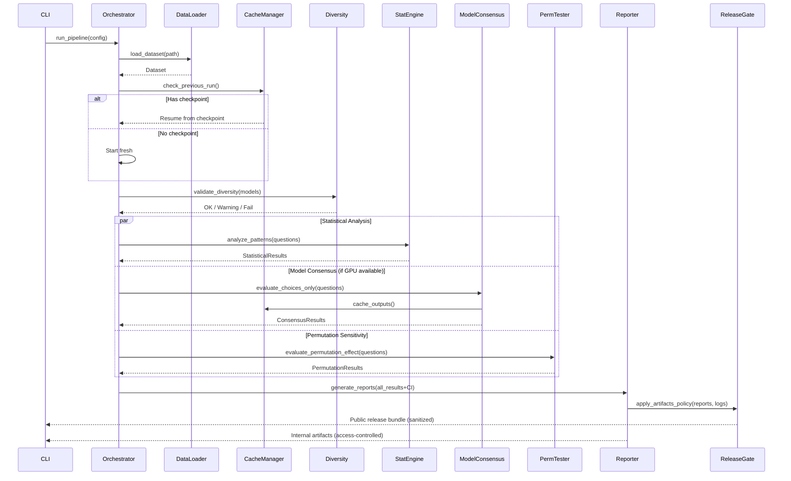

# Data Flow Architecture

## Processing Pipeline Stages

```mermaid
sequenceDiagram
    participant CLI
    participant Orchestrator
    participant DataLoader
    participant CacheManager
    participant Diversity
    participant StatEngine
    participant ModelConsensus
    participant PermTester
    participant Reporter
    participant ReleaseGate
    
    CLI->>Orchestrator: run_pipeline(config)
    Orchestrator->>DataLoader: load_dataset(path)
    DataLoader-->>Orchestrator: Dataset
    
    Orchestrator->>CacheManager: check_previous_run()
    alt Has checkpoint
        CacheManager-->>Orchestrator: Resume from checkpoint
    else No checkpoint
        Orchestrator->>Orchestrator: Start fresh
    end
    Orchestrator->>Diversity: validate_diversity(models)
    Diversity-->>Orchestrator: OK / Warning / Fail
    
    par Statistical Analysis
        Orchestrator->>StatEngine: analyze_patterns(questions)
        StatEngine-->>Orchestrator: StatisticalResults
    and Model Consensus (if GPU available)
        Orchestrator->>ModelConsensus: evaluate_choices_only(questions)
        ModelConsensus->>CacheManager: cache_outputs()
        ModelConsensus-->>Orchestrator: ConsensusResults
    and Permutation Sensitivity
        Orchestrator->>PermTester: evaluate_permutation_effect(questions)
        PermTester-->>Orchestrator: PermutationResults
    end
    
    Orchestrator->>Reporter: generate_reports(all_results+CI)
    Reporter->>ReleaseGate: apply_artifacts_policy(reports, logs)
    ReleaseGate-->>CLI: Public release bundle (sanitized)
    Reporter-->>CLI: Internal artifacts (access-controlled)
```
