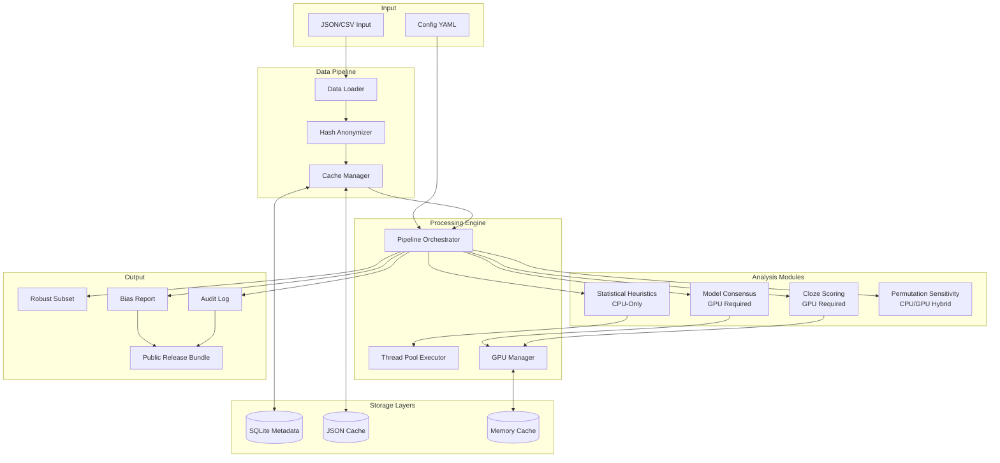

# High Level Architecture

## Technical Summary

RobustCBRN Eval implements a modular pipeline architecture with pluggable components for consensus detection, statistical analysis, and cloze scoring that can fail independently. The system employs multi-level caching (SQLite metadata, JSON model outputs, memory logits) with checkpoint recovery, sequential model loading to manage 2–3 7B parameter models on a single A100 GPU, and pure NumPy implementations of all statistical methods. The architecture ensures that statistical analysis continues functioning even if GPU inference fails. All processing supports a deterministic mode with fixed seeds and stable execution order to meet <2% run-to-run variance. A model diversity policy enforces heterogeneous open‑source families per PRD (e.g., Llama/Meta, Mistral, Qwen, OLMo). A two‑tier artifacts policy governs sensitive data: caches never store plaintext; internal logs may include rendered prompts for reproducibility under access controls; public artifacts contain only sanitized aggregates. Confidence‑interval–backed filtering, permutation sensitivity testing, and cost/throughput instrumentation align outcomes with the PRD’s quantitative goals.

## Platform and Infrastructure Choice

**Platform:** Linux (Ubuntu 20.04+) with CUDA 11.8+
**Deployment Target:** Lambda GPU Cloud / Local GPU workstation
**GPU Requirements:** 24GB+ VRAM (optimal: A100 40GB)
**Storage:** Local NVMe SSD for high-speed caching (100–150GB for MVP; 500GB recommended for scaling)
**Container Support:** Docker for reproducible environment

## Repository Structure

**Structure:** Monorepo with clear module separation
**Package Management:** Python native with virtual environments
**Module Organization:** 
- Core pipeline modules (`src/`)
- Statistical analysis (`src/analysis/`)
- Model inference (`src/models/`)
- Utilities (`src/utils/`)
- Configuration (`configs/`)
- Tests (`tests/`)

## High Level Architecture Diagram

## Architectural Patterns

- **Modular Pipeline Pattern:** Independent components that can be enabled/disabled/combined via configuration - _Rationale:_ Enables graceful degradation when GPU unavailable and parallel development
- **Multi-Level Caching:** SQLite for metadata, JSON for model outputs, memory for active logits - _Rationale:_ Optimizes for different access patterns and recovery scenarios
- **Fail-Graceful Degradation:** Continue with available components if others fail - _Rationale:_ Critical for hackathon demo resilience and production reliability
- **Checkpoint Recovery:** Save state every 100 questions with automatic resume - _Rationale:_ Handles interruptions common in GPU cloud environments
- **Pure Function Statistical:** All statistics implemented as pure functions without side effects - _Rationale:_ Ensures reproducibility and testability
- **Sequential Model Loading:** Load/unload models one at a time to manage memory - _Rationale:_ Enables running 2-3 7B models on single GPU
- **Deterministic Execution Mode:** Fixed seeds, sorted operations, controlled initialization, deterministic kernels, and disabled non-deterministic GPU optimizations when required - _Rationale:_ Meets <2% variance target across runs
- **Hash-Based Anonymization:** SHA-256 with two salts for question IDs (private per-project salt for internal artifacts; fixed public salt for sanitized subset) - _Rationale:_ Enables tracking and public reproducibility without exposing content; caches never store plaintext
- **Model Family Diversity Policy:** Enforce heterogeneous open-source model families (e.g., Llama/Meta, Mistral, Qwen, OLMo) with warnings/fail-fast if violated - _Rationale:_ Satisfies FR1 and strengthens consensus signal while maintaining open reproducibility
- **CI-Backed Filtering:** Integrate bootstrap confidence intervals into filter decisions and reports - _Rationale:_ Satisfies FR7/FR9 with quantified uncertainty
- **Permutation Sensitivity:** Random 0–1 option reorder per item with re-scoring and delta analysis - _Rationale:_ Satisfies FR11 and reveals brittle question formats
